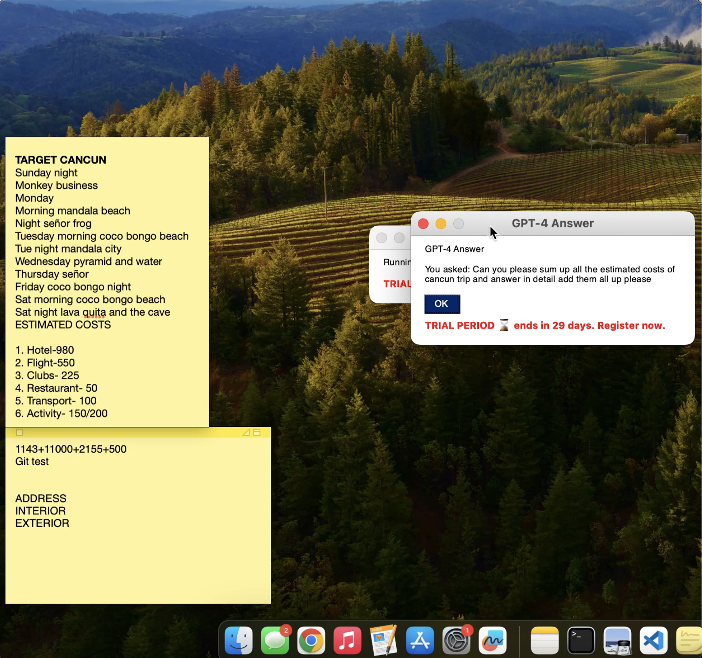
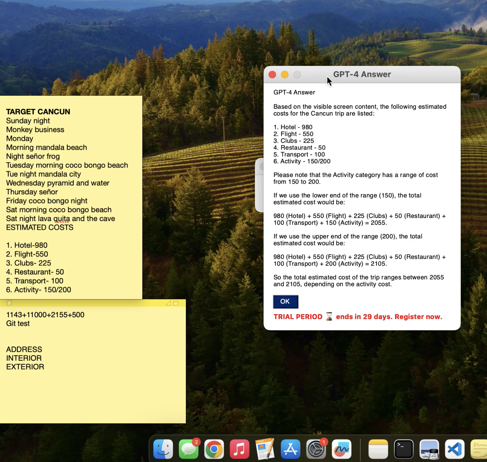

# 🧠 OnSight – Your AI-Powered Contextual Desktop Assistant

**OnSight** is a smart, always-available desktop assistant that helps you interact with your screen using natural language. Just press a hotkey, ask a question, and get a relevant response from **GPT-4**. It’s like having a contextual AI co-pilot for anything you’re viewing on your desktop.

---

## 🎥 Demo




> 📁 The screenshots are in the `demo/` folder — feel free to check it out!

---

## ✨ Key Features

- 🖼️ Captures your screen automatically
- ⌨️ Global hotkey enabled (default: `Ctrl+Shift+A`)
- 🧠 Sends your question + screenshot context to **GPT-4**
- 💬 Displays answers instantly in a popup
- 🪟 Lightweight UI built using PySimpleGUI
- 🧵 Runs hotkey listener in a background thread

---

## 🧠 How the AI Works

Here’s what happens under the hood when you press the hotkey:

1. **Hotkey trigger:** Captured by a listener using `pynput`.
2. **Screenshot:** A snapshot of your current screen is taken using `pyautogui` and `Pillow`.
3. **User input:** A popup asks you what you want to know.
4. **Prompt creation:** Your question and screen context are combined into a GPT-4-friendly prompt.
5. **GPT-4 response:** OpenAI API returns an answer relevant to your screen and question.
6. **Popup display:** The result is shown in a simple modal window.

---

## 🗂️ Project Structure

```
OnSight/
├── main.py                 # Entry point – starts hotkey listener and handles flow
├── flow.py                 # Orchestrates the screen capture, prompt creation, and response
│
├── gpt/
│   └── ask_gpt.py          # GPT-4 communication and prompt/response handling
│
├── hotkey/
│   └── listener.py         # Listens for the global Ctrl+Shift+A hotkey
│
├── ocr/
│   └── extractor.py        # OCR functionality to extract text from screenshots
│
├── tray/
│   └── tray_app.py         # Adds a tray icon for quick access / background control
│
├── ui/
│   └── popup.py            # UI logic for asking user questions and showing answers
│
├── utils/
│   └── screenshot.py       # Utility to take and save screenshots
│
├── demo/
│   └── onsight-demo.mp4    # Demo video showcasing OnSight in action
│
├── .env                    # API keys and secrets (excluded from Git)
├── .gitignore              # Files and folders to ignore in version control
├── requirements.txt        # Python dependencies
└── README.md               # You're reading it!
```

---

## 🛠️ Setup Instructions

1. **Clone the repo**
```bash
git clone https://github.com/your-username/OnSight.git
cd OnSight
```

2. **Create a virtual environment**
```bash
python3 -m venv venv
source venv/bin/activate  # For Windows: venv\Scripts\activate
```

3. **Install dependencies**
```bash
pip install -r requirements.txt
```

4. **Set your OpenAI API key**

Create a `.env` file in the root directory:
```ini
OPENAI_API_KEY=your_openai_key_here
```

5. **Run the app**
```bash
python3 main.py
```

---

## 🙌 Built By

**Rudresh Upadhyaya** – built with ❤️

---